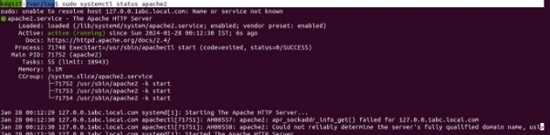
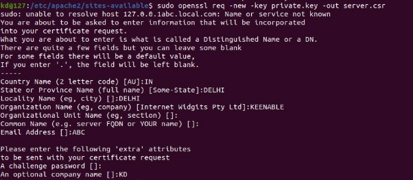
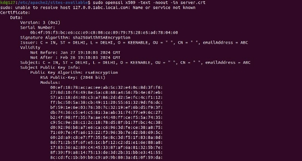
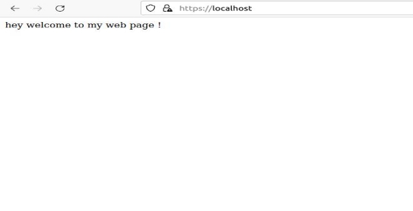
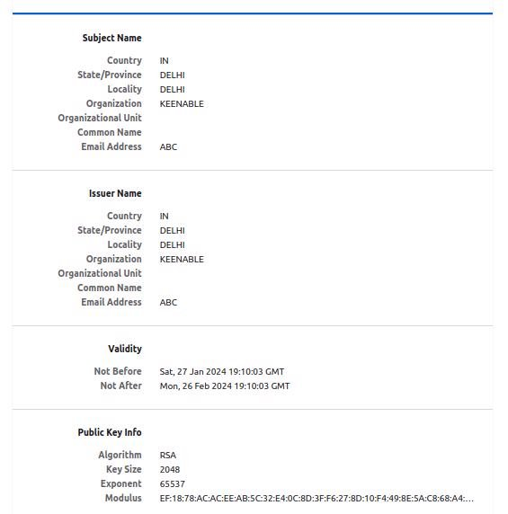
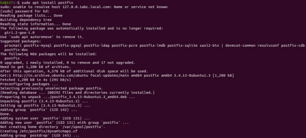
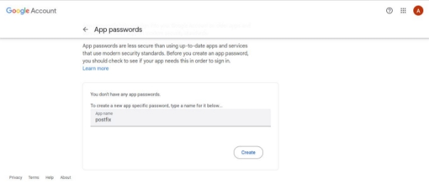
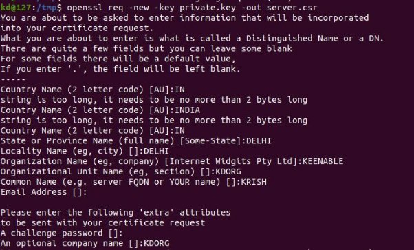
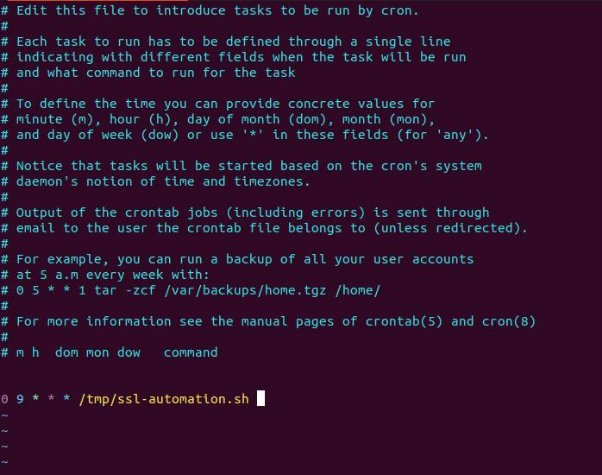

Email alerts for ssl expiry

Problem :- We have to manually check the certificate expiry.

Solution :- Setting up of email alerts for the certificate expiry before due date

Task :- Email alert when is ssl certificate expired on server

Prerequisite :

1. Os (Rhel, Ubuntu , etc)
1. Root privileges

To be installed :

1. Apache (For testing ssl certificates )
1. Openssl (For creating ssl certificates )
1. Smtp postfix (For sharing the email alerts )
1. Send mail (For sharing mails )
1. Script (For creating email alerts for ssl expiry )
1. Script (To update the new certificate as soon we get and deploy to location)
1. Crontab (For scheduling the tasks to run script )
1. **Setting up of apache server to check the ssl**

kd@127:~$ sudo apt install apache2

kd@127:/var/log$ sudo systemctl status apache2

2. **Setting up of openssl and creating of self-signed certificate**

sudo apt-get update

sudo apt-get install openssl

**Generate a Private Key:** Use OpenSSL to generate a private key: kd@127:/etc/apache2/sites-available$ sudo openssl genpkey -algorithm RSA -out private.key

**Create a Certificate Signing Request (CSR):** Generate a CSR, which is a file that contains information about the organization and the public key:

kd@127:/etc/apache2/sites-available$ sudo openssl req -new -key private.key -out server.csr

**Generate a Self-Signed Certificate:** Use the private key to generate a self-signed certificate:

kd@127:/etc/apache2/sites-available$ sudo openssl req -x509 -key private.key -in server.csr -out server.crt

**Verify the Generated Certificate:**

kd@127:/etc/apache2/sites-available$ sudo openssl x509 -text -noout -in server.crt

**Update the VirtualHost configuration to include the SSL settings:** Change the configuration as required kd@127:/etc/apache2/sites-available$ cat 000-default.conf

<VirtualHost \*:80>

ServerAdmin webmaster@localhost ServerName localhost

DocumentRoot /var/www/html

ErrorLog ${APACHE\_LOG\_DIR}/error.log

CustomLog ${APACHE\_LOG\_DIR}/access.log combined

Redirect "/" "https://localhost/" </VirtualHost>

<VirtualHost \*:443>

ServerAdmin webmaster@localhost ServerName your\_domain\_or\_ip

DocumentRoot /var/www/html

ErrorLog ${APACHE\_LOG\_DIR}/error.log

CustomLog ${APACHE\_LOG\_DIR}/access.log combined

SSLEngine on

SSLCertificateFile /etc/apache2/sites-available/server.crt SSLCertificateKeyFile /etc/apache2/sites-available/private.key

- Optional: SSLCertificateChainFile /path/to/your/chainfile.pem

<FilesMatch "\.(cgi|shtml|phtml|php)$"> SSLOptions +StdEnvVars

</FilesMatch>

<Directory /usr/lib/cgi-bin> SSLOptions +StdEnvVars

</Directory>

BrowserMatch "MSIE [2-6]" \

nokeepalive ssl-unclean-shutdown \ downgrade-1.0 force-response-1.0

BrowserMatch "MSIE [17-9]" ssl-unclean-shutdown

</VirtualHost>

**Enable the SSL module and the new site configuration:** kd@127:/etc/apache2/sites-available$ sudo a2enmod ssl

kd@127:/etc/apache2/sites-available$ sudo a2ensite 000-default.conf

**Restart Apache to apply the changes:** kd@127:/etc/apache2/sites-available$ sudo systemctl restart apache2

Now navigate to <https://localhost>

You will see that our page is now secured N

Now lets see our self signed certificate -

Now our certificate is set up now we need to create a script for creating alerts for ssl

For that we need postfix (smtp) for sharing mail alerts and crontab and mutt or mailx for sharing mail .

3. **Setting up of postfix :-**

For that first we had to set up hostname using the following command

kd@127:~$ sudo hostnamectl set-hostname abc.local.com

**Now install postfix using the below command** kd@127:~$ sudo apt install postfix

Go to main.cf file in /etc/postfix/main.cf **Add the below configuration**

- See /usr/share/postfix/main.cf.dist for a commented, more complete version
- Debian specific: Specifying a file name will cause the first
- line of that file to be used as the name. The Debian default
- is /etc/mailname.

  #myorigin = /etc/mailname

smtpd\_banner = $myhostname ESMTP $mail\_name (Ubuntu) biff = no

- appending .domain is the MUA's job. append\_dot\_mydomain = no
- Uncomment the next line to generate "delayed mail" warnings #delay\_warning\_time = 4h

  readme\_directory = no

- See http://www.postfix.org/COMPATIBILITY\_README.html -- default to 2 on
- fresh installs.

  compatibility\_level = 2

- TLS parameters smtpd\_tls\_cert\_file=/etc/ssl/certs/ssl-cert-snakeoil.pem smtpd\_tls\_key\_file=/etc/ssl/private/ssl-cert-snakeoil.key smtpd\_tls\_security\_level=may

  smtp\_tls\_CApath=/etc/ssl/certs

smtp\_tls\_security\_level=may

smtp\_tls\_session\_cache\_database = btree:${data\_directory}/smtp\_scache

smtpd\_relay\_restrictions = permit\_mynetworks permit\_sasl\_authenticated defer\_unauth\_destination

myhostname = abc.local.com

alias\_maps = hash:/etc/aliases

alias\_database = hash:/etc/aliases

myorigin = /etc/mailname

mydestination = $myhostname, abc.local.com, localhost, localhost.localdomain, localhost

relayhost =

mynetworks = 127.0.0.0/8 [::ffff:127.0.0.0]/104 [::1]/128 mailbox\_size\_limit = 0

recipient\_delimiter = +

inet\_interfaces = all

inet\_protocols = all

**Generate Google App Password for Postfix**

We need to generate an App password

Log in to your email, then click the following link:[ Manage your account access and security settings.](https://myaccount.google.com/security)

Scroll down to “Signing into Google” and click 2-Step Verification. You may be asked for your password and a verification code before continuing. Ensure that 2-Step Verification is enabled.

Click the following link to[ Generate an App password](https://security.google.com/settings/security/apppasswords) for Postfix:

**Add Gmail Username and App Password to Postfix configuration**

You need to add your username and password in this file sasl\_passwd to this directory /etc/postfix/sasl/

Create /etc/postfix/sasl/sasl\_passwd file and add your gmail ID and password we have just created using below command

root@ip-172-31-0-205:/etc/postfix/sasl# sudo nano sasl\_passwd And add your gmail ID and password as shown

**create the hash file for Postfix using the postmap command** postmap /etc/postfix/sasl/sasl\_passwd

After execute postmap command you should have a new file named sasl\_passwd.db in the /etc/postfix/.

**Secure Your Postfix Hash Database and Email Password Files**

chown root:root /etc/postfix/sasl/sasl\_passwd /etc/postfix/sasl/sasl\_passwd.db chmod 0600 /etc/postfix/sasl/sasl\_passwd /etc/postfix/sasl/sasl\_passwd.db

**Configure Relay Host postfix with gmail**

Modify the main.cf file using below command: sudo vim /etc/postfix/main.cf

Set the relayhost

relayhost = [smtp.gmail.com]:587

If you want to check your relayhost set or not then run the below command and you will get output like this:

**Add Custom Configuration**

Open main.cf file and this below line end on the file sudo vim /etc/postfix/main.cf

- Enable SASL authentication

smtp\_sasl\_auth\_enable = yes

- Disallow methods that allow anonymous authentication smtp\_sasl\_security\_options = noanonymous
- Location of sasl\_passwd

  smtp\_sasl\_password\_maps = hash:/etc/postfix/sasl/sasl\_passwd

- Enable STARTTLS encryption

smtp\_tls\_security\_level = encrypt

- Location of CA certificates

smtp\_tls\_CAfile = /etc/ssl/certs/ca-certificates.crt

4. **Send Email using sendmail**

Lets test whether our SMTP server

kd@127:~$ sendmail alertbot01@gmail.com From: root@gmail.com

Subject: test mail

testing

.

Received our first mail successfully

Now lets create a script which will check **For ssl certificate expiring --> email msg should be sent 7 days before onwards, at the same time once the New Certificate Received, should be deployed Automatically and confirmation Message must be sent to all Members.**

5. **Steps to create script :**
1. Create a script using vim command

2. Paste the content inside the file

In this file we have defined the alert threshold as 200 for getting alert we can change it as our requirement for that i had set to 7 days .

#!/bin/bash

SSL\_HOSTNAME="www.localhost" SSL\_PORT=443

ALERT\_THRESHOLD=200 RECIPIENT\_EMAIL="alertbot01@gmail.com"

cert\_info=$(openssl s\_client -showcerts -connect "${SSL\_HOSTNAME}:${SSL\_PORT}" </dev/null 2>/dev/null)

if [[ $? -eq 0 ]]; then

expiration\_date=$(echo "${cert\_info}" | openssl x509 -noout -enddate | cut -d= -f2)

if [ -n "${expiration\_date}" ]; then

expiration\_epoch=$(date -d "${expiration\_date}" +%s) current\_epoch=$(date +%s)

days\_until\_expiry=$(( (${expiration\_epoch} - ${current\_epoch}) /

86400 ))

if [ ${days\_until\_expiry} -gt 0 ]; then

echo "The SSL certificate is valid for ${days\_until\_expiry} days."

if [ ${days\_until\_expiry} -le ${ALERT\_THRESHOLD} ]; then

echo "Sending email alert..."

{

echo "To: ${RECIPIENT\_EMAIL}"

echo "Subject: SSL Certificate Expiry Alert" echo

echo "The SSL certificate for ${SSL\_HOSTNAME} is about to expire in ${days\_until\_expiry} days."

echo "Please take appropriate action to renew the certificate."

} | sendmail -t

echo "Email alert sent."

fi

else

echo "The SSL certificate has expired or is about to

expire."

fi

else

echo "Error extracting expiration date from SSL certificate." fi

else

echo "Error connecting to the SSL endpoint."

fi

3. Change the permission of the script using chmod command chmod + x ssl.sh

Testing :

1. Test the script using sh or ./ command

2. Checking the mail box for the related mail .

**Now lets create another script for automatic deployment of ssl certificate whenever we get.**

**Scenario :- For this we assume that we will get certificate in /tmp directory and when our certificate will expire it will automatically deploy to the location like in apache we have**

I have created ssl certificate in tmp for the testing purpose kd@127:/tmp$ openssl genpkey -algorithm RSA -out private.key

kd@127:/tmp$ openssl req -new -key private.key -out server.csr

kd@127:/tmp$ openssl x509 -req -days 90 -in server.csr -signkey private.key -out server.crt

6. **Now lets create a script for automatic deployment of this certificate and then sharing of notifications to the team members**

   Create a file in tmp using vim command

kd@127:/tmp$ cat ssl-automation.sh

#!/bin/bash

- SSL certificate expiration check

SSL\_HOSTNAME="www.localhost"

SSL\_PORT=443

ALERT\_THRESHOLD=7 # Number of days before expiration to send an alert RECIPIENT\_EMAIL="alertbot01@gmail.com"

cert\_info=$(openssl s\_client -showcerts -connect "${SSL\_HOSTNAME}:${SSL\_PORT}" </dev/null 2>/dev/null)

if [[ $? -eq 0 ]]; then

expiration\_date=$(echo "${cert\_info}" | openssl x509 -noout -enddate | cut -d= -f2)![ref1]

if [ -n "${expiration\_date}" ]; then

expiration\_epoch=$(date -d "${expiration\_date}" +%s) current\_epoch=$(date +%s)

days\_until\_expiry=$(( (${expiration\_epoch} - ${current\_epoch}) / 86400 ))

if [ ${days\_until\_expiry} -le ${ALERT\_THRESHOLD} ]; then

echo "Sending SSL certificate alert..."

{

echo "To: ${RECIPIENT\_EMAIL}"

echo "Subject: SSL Certificate Expiry Alert"

echo

echo "The SSL certificate for ${SSL\_HOSTNAME} is about to expire in ${days\_until\_expiry} days."

echo "Please take appropriate action to renew the certificate."

} | sendmail -t

echo "SSL certificate alert email sent."

- Check if certificate files are in /tmp

if [ -e /tmp/private.key ] && [ -e /tmp/server.csr ] && [ -e

/tmp/server.crt ]; then

- Set the path to the Apache sites-available directory APACHE\_DIR="/etc/apache2/sites-available"
- Move the files to the Apache directory sudo mv /tmp/private.key /tmp/server.csr

/tmp/server.crt "$APACHE\_DIR/"

- Reload Apache

sudo systemctl reload apache2

if [ $? -eq 0 ]; then

echo "New SSL certificate deployed. Apache reloaded." echo "Sending deployment alert..."

{

echo "To: ${RECIPIENT\_EMAIL}"

echo "Subject: SSL Certificate Deployment Alert" echo

echo "A new SSL certificate has been successfully deployed for ${SSL\_HOSTNAME}."

} | sendmail -t

echo "Deployment alert email sent."

else

echo "Error reloading Apache. Please check the Apache configuration."

fi

else

echo "Certificate files not found in /tmp. Email

notification sent."

fi

else

echo "The SSL certificate is valid for ${days\_until\_expiry} days."

fi

else

echo "Error extracting expiration date from SSL certificate." fi

else

echo "Error connecting to the SSL endpoint." fi

**Change the permission of the file using chmod** kd@127:/tmp$ chmod +x ssl-automation.sh

**Now run the script**

kd@127:/tmp$ sudo ./ssl-automation.sh

Mail what we got :

7. **Now setting up of cronjob to run this script everyday so that we dont miss any alert**

As per server requirement i have created new script for ssl alerts

#!/bin/bash

- Array of URLs to check URLS=("www.kibana-openshift-logging.apps.upiprod.finopaymentbank.in" "www.kiali-istio-system.apps.upiprod.finopaymentbank.in" "www.10.71.87.48:8080")

  EXPIRED\_THRESHOLD=0 # Number of days after expiration to trigger alert ALERT\_THRESHOLD=7 # Number of days before expiration to trigger alert RECIPIENT\_EMAIL="krish\_01@fosteringlinux.com" SENDER\_EMAIL="vikas\_dhumale@finobank.com"

- Function to send email alert

send\_email\_alert() {

local subject=$1

local body=$2

echo -e "${body}" | mailx -s "${subject}" -r "${SENDER\_EMAIL}" -S smtp="10.71.87.201:25" "${RECIPIENT\_EMAIL}"

echo "Email alert sent."

}

- Function to check SSL certificate for a given URL check\_ssl\_certificate() {

local SSL\_HOSTNAME=$1

local SSL\_PORT=443

cert\_info=$(openssl s\_client -showcerts -connect "${SSL\_HOSTNAME}:${SSL\_PORT}" </dev/null 2>/dev/null)

if [[ $? -eq 0 ]]; then

expiration\_date=$(echo "${cert\_info}" | openssl x509 -noout -enddate | cut -d= -f2)

if [ -n "${expiration\_date}" ]; then

expiration\_epoch=$(date -d "${expiration\_date}" +%s) current\_epoch=$(date +%s)

days\_until\_expiry=$(( (${expiration\_epoch} - ${current\_epoch}) / 86400 ))

if [ ${days\_until\_expiry} -gt ${EXPIRED\_THRESHOLD} ]; then echo "The SSL certificate for ${SSL\_HOSTNAME} is valid

for ${days\_until\_expiry} days."

if [ ${days\_until\_expiry} -le ${ALERT\_THRESHOLD} ];

then![ref1]

echo "Sending email alert for SSL certificate expiry..."

subject="SSL Certificate Expiry Alert for ${SSL\_HOSTNAME}"

email\_body="The SSL certificate for ${SSL\_HOSTNAME} is about to expire in ${days\_until\_expiry} days. Please take appropriate action to renew the certificate."

send\_email\_alert "${subject}" "${email\_body}"

fi

else

echo "The SSL certificate for ${SSL\_HOSTNAME} has expired."

echo "Sending email alert for expired SSL certificate..."

subject="Expired SSL Certificate Alert for ${SSL\_HOSTNAME}"

email\_body="The SSL certificate for ${SSL\_HOSTNAME} has expired. Please take immediate action to renew the certificate."

send\_email\_alert "${subject}" "${email\_body}"

fi

else

echo "Error extracting expiration date from SSL certificate for ${SSL\_HOSTNAME}."

echo "Sending email alert for expiration date extraction error..."

subject="SSL Certificate Expiry Alert Error for ${SSL\_HOSTNAME}"

email\_body="Error extracting expiration date from SSL certificate for ${SSL\_HOSTNAME}. Please check the SSL configuration."

send\_email\_alert "${subject}" "${email\_body}"

fi

else

echo "Error connecting to the SSL endpoint for ${SSL\_HOSTNAME}."

echo "Sending email alert for SSL connection error..."

subject="SSL Connection Error for ${SSL\_HOSTNAME}"

email\_body="Error connecting to the SSL endpoint for ${SSL\_HOSTNAME}. Please check the SSL configuration and server availability."

send\_email\_alert "${subject}" "${email\_body}"

fi

}

- Loop through each URL and check SSL certificate for URL in "${URLS[@]}"; do

check\_ssl\_certificate "$URL"

done

What the script do :-

1. An array named URLS is defined containing the URLs to be checked for SSL certificate validity.
1. Two threshold values are set:
   1. EXPIRED\_THRESHOLD: Number of days after expiration to trigger an alert.
   1. ALERT\_THRESHOLD: Number of days before expiration to trigger an alert.
3. Email addresses for sending alerts are defined:
   1. RECIPIENT\_EMAIL: Email address where alerts will be sent.
   1. SENDER\_EMAIL: Email address from which alerts will be sent.
4. The function send\_email\_alert() is defined to send email alerts. It takes two parameters: subject and body of the email.
4. The function check\_ssl\_certificate() is defined to check the SSL certificate for a given URL. It takes the hostname as a parameter.
4. Inside the check\_ssl\_certificate() function:
- It attempts to establish a connection to the SSL endpoint of the given URL.
- If the connection is successful:
  - It extracts the expiration date of the SSL certificate.
  - Calculates the number of days until the certificate expires.
  - Checks if the certificate is expired or about to expire based on the threshold values.
  - Sends an email alert if the certificate is about to expire or has expired.
- If the connection fails:
  - Sends an email alert for SSL connection error.
7. The script then loops through each URL in the URLS array and calls the check\_ssl\_certificate() function for each URL.
7. For each URL, the script checks the SSL certificate validity and sends appropriate email alerts based on the results.
7. Finally, the script execution completes after checking all URLs in the array.

[ref1]: Aspose.Words.bd375e2b-1813-4c1d-8210-03451e04ccd9.038.png
